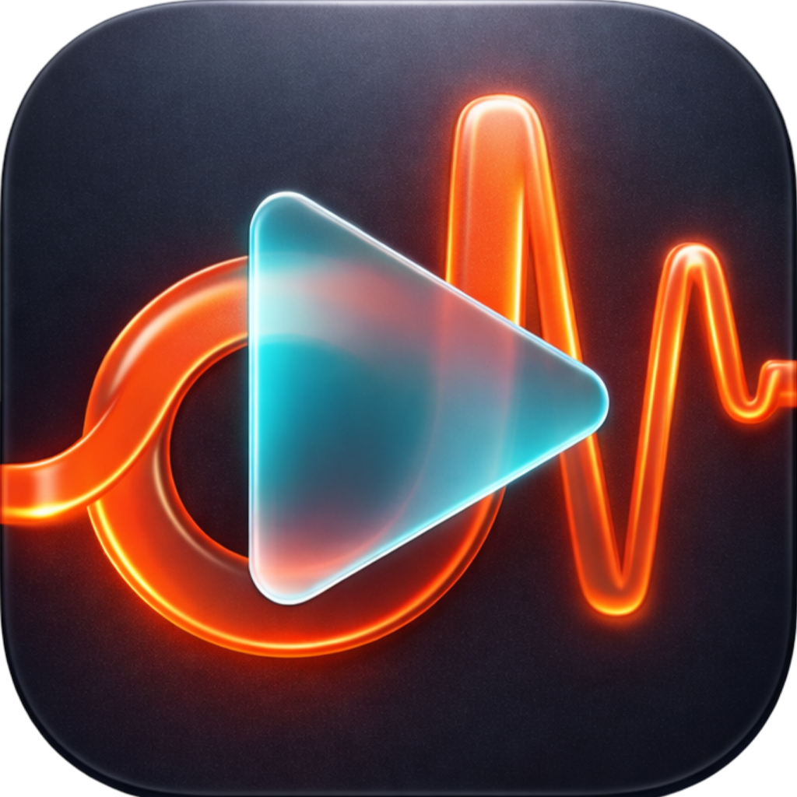
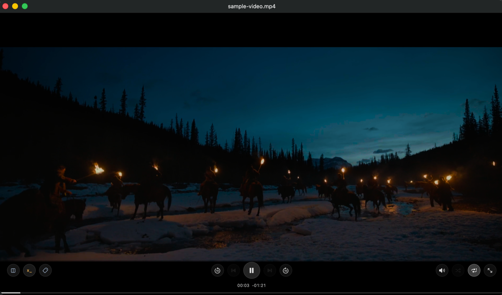
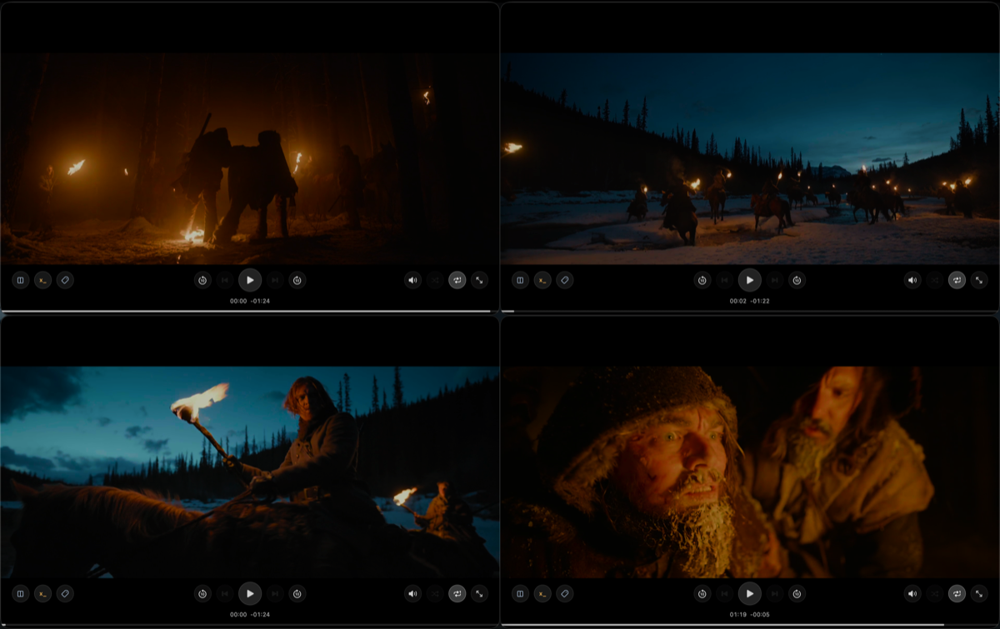
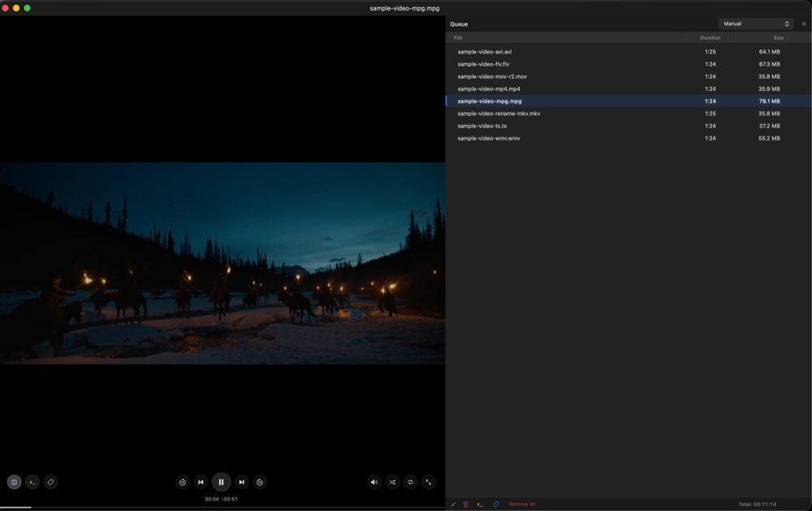
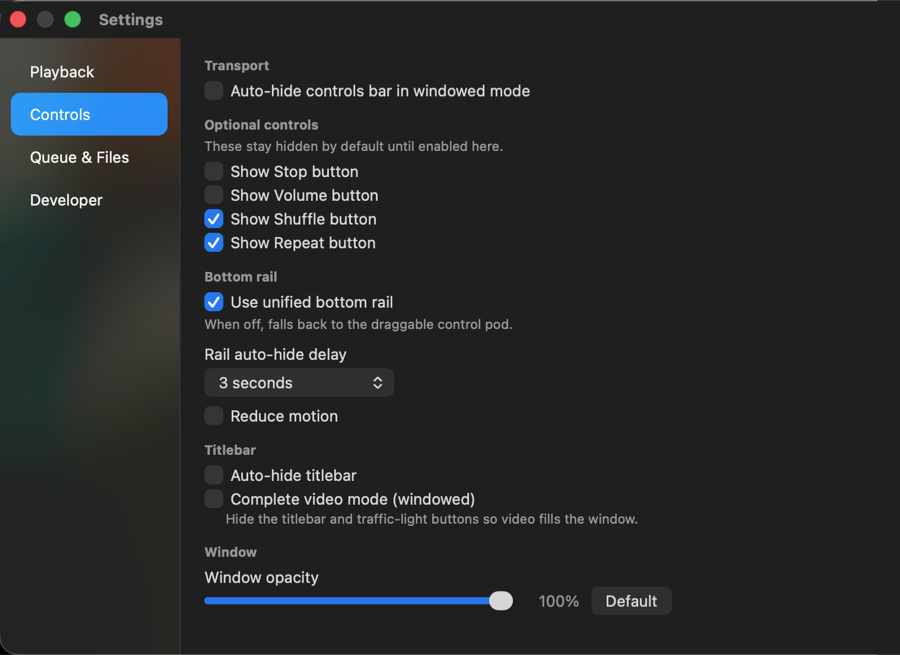

<p align="center">
  
</p>

<h1 align="center">dwb video player</h1>

<p align="center">
  A lightweight macOS video player built for fast queueing, multi-window playback, and local media control.
</p>

<p align="center">
  
</p>

## Overview

dwb video player is a native AppKit media player for macOS 13 and newer. Version 4.0 focuses on local playback, quick queue building, independent player windows, and practical controls for working through files on disk.

Playback is powered by VLCKit through Swift Package Manager. The app is local-media only: it does not provide streaming, cloud sync, telemetry, transcoding, or media-library management.

## Features

### Playback

- Native Swift and AppKit macOS application with programmatic UI.
- VLCKit-backed local video playback.
- Common local video formats including `mp4`, `mov`, `avi`, `flv`, `wmv`, `mkv`, `ts`, and `mpg`.
- Still-image and animated GIF playback with configurable slideshow duration and GIF loop count.
- Drag-and-drop, Finder/Open With, Dock open, menu open, and folder expansion for supported media.
- Top-insert behavior for explicitly opened or dropped files so new files can be queued quickly.
- Play/pause, previous/next, configurable rewind/forward skip controls, scrubber seeking, volume, mute, fullscreen, Fit/Fill/Stretch scale modes, and Keep Window On Top.
- Repeat One plus a three-state shuffle cycle: Off, Shuffle, and Endless Shuffle.
- Stop isolation, stop-to-Queue-Page flow, paused-near-end completion handling, and queue restart from the beginning after natural completion.

### Queue

- Full Queue Page with filename, duration, file size, and total queue duration.
- Manual queue ordering by row drag, plus sorting by name, size, and duration.
- Single-click row selection and double-click-to-play.
- Multi-select queue operations, Remove All, and Delete/Backspace removal for selected rows.
- Reveal in Finder and rename actions for queue items.
- Optional one-click `x_` prefix rename, including the `q` key binding.
- Optional custom-prefix rename for the Queue Page and player page.
- Quick Queue support, including an optional setting to open the Queue Page when a player window opens.

### Windows And Controls

- Multiple independent player windows, each with its own playback state.
- Per-window volume and mute state, with persisted volume used as the default for new windows.
- Command+4 Four Window Grid layout for arranging four player windows.
- Unified bottom rail with optional transport buttons and auto-hide behavior.
- Draggable, resizable fallback control pod with persisted placement.
- Optional titlebar auto-hide and Complete Video Mode for windowed fill playback.
- Per-window opacity slider from 35% to 100%.

### Settings And Developer Support

- Settings window organized into Playback, Controls, Queue & Files, and Developer sections.
- Configurable skip duration, slideshow duration, GIF loop count, optional transport buttons, Queue Page behavior, rename options, titlebar behavior, complete video mode, rail behavior, and window opacity.
- Developer/debugging support through the Debug Console with filtering, snapshots, export, and optional verbose autoplay tracing.

## Screenshots

<p align="center">
  
</p>

<p align="center">
  
</p>

<p align="center">
  
</p>

## Requirements

- macOS 13 or newer
- Xcode with command line tools
- Swift 5.9-compatible toolchain
- Network access for Swift Package Manager on first build, unless VLCKit is already cached locally
- Optional: `xcodegen` to regenerate `dwb/dwb.xcodeproj` from `dwb/project.yml`

## Build From Source

Build the app from the repository root:

```sh
./scripts/build-app.sh
```

The script builds the `dwb` scheme in Release configuration and copies the app bundle to:

```text
dist/dwb.app
```

It also writes local build metadata to:

```text
dist/dwb-app-build-info.txt
```

If `project.yml` changes and you need to regenerate the Xcode project:

```sh
cd dwb
xcodegen generate --spec project.yml
cd ..
./scripts/build-app.sh
```

## Release Status / Signing Note

This repository currently provides source code only. It does not publish signed or notarized release downloads, installer packages, App Store builds, or release assets.

Local builds use the project signing settings in this repository and are not notarized unless you sign and notarize them yourself.

## Project Structure

```text
dwb/
  project.yml
  dwb.xcodeproj/
  dwb/
    App/
    Player/
    Resources/
docs/images/
scripts/
  build-app.sh
  build-installer.sh
```

`dist/`, `.tmp/`, `DerivedData/`, build logs, archives, package outputs, signing material, and local user state are intentionally ignored by git.

## License

MIT. See `LICENSE`.

This repository's MIT license applies to this app's source code, not to VLCKit, libVLC, or other third-party dependencies.
